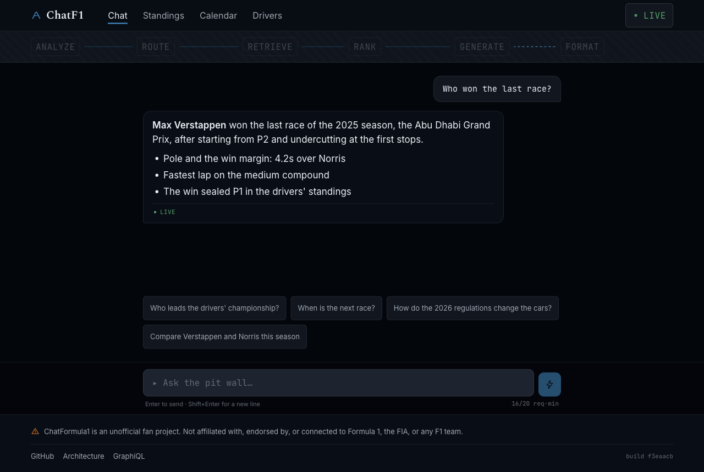
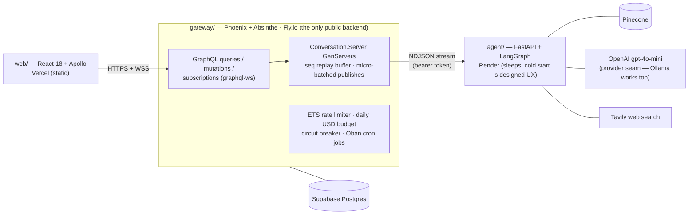
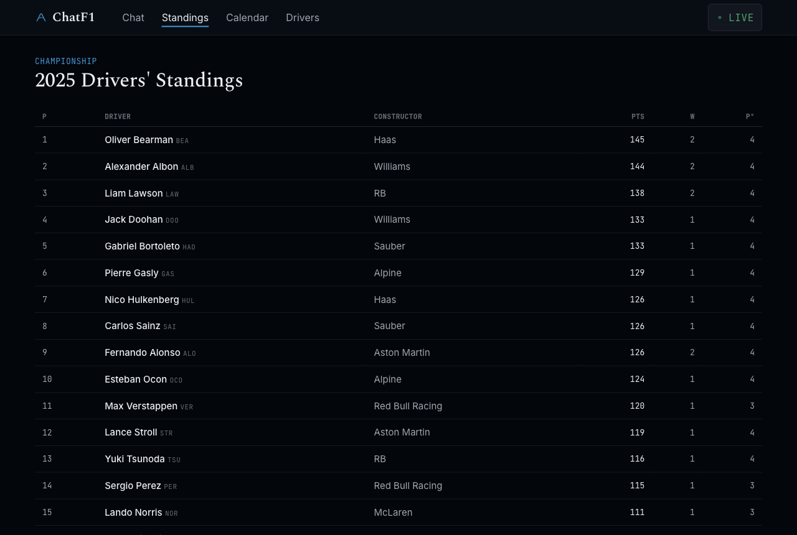
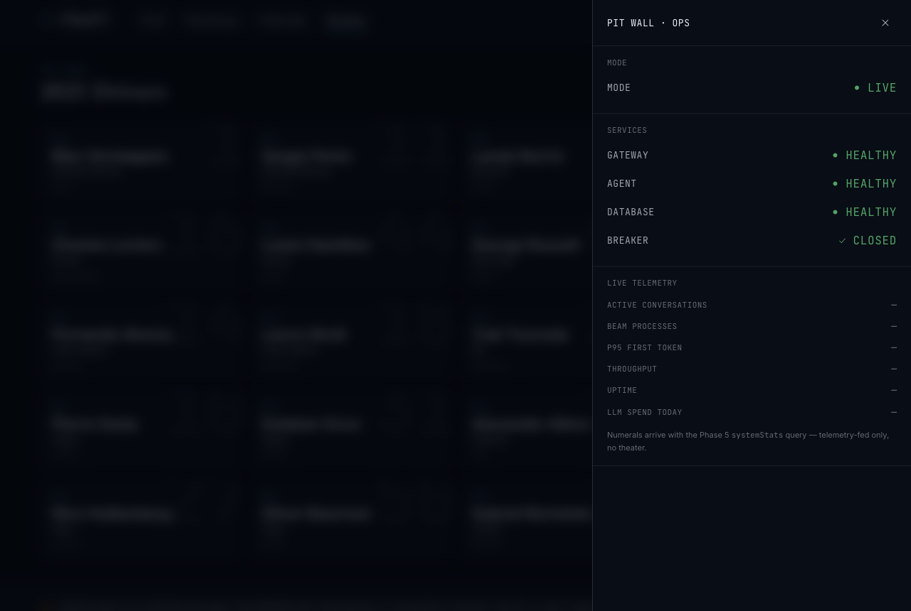

# ChatFormula1

A Formula 1 chat application that streams LLM tokens from a Python
LangGraph pipeline through a supervised Elixir/OTP process tree into a
GraphQL subscription, rendered live in React — built to run on free
tiers without feeling free.

> ChatFormula1 is an unofficial fan project. It is not affiliated with,
> endorsed by, or connected to Formula 1, the FIA, or any F1 team.

[](https://github.com/prateekmulye/ChatFormula1/actions/workflows/agent.yml)
[](https://github.com/prateekmulye/ChatFormula1/actions/workflows/gateway.yml)
[](https://github.com/prateekmulye/ChatFormula1/actions/workflows/web.yml)



The strip above the chat shows which LangGraph node is executing while
tokens stream in. Kill the Python service mid-stream and the supervisor
publishes a normalized error, the circuit breaker opens, and every other
conversation keeps streaming — failure handling is part of the demo, not
an apology. The full demo script is in [docs/DEMO.md](docs/DEMO.md).

## Architecture



The Elixir gateway is the application: all state, identity, rate
limiting, budget enforcement, and scheduling live on the BEAM. Python is
a stateless inference engine — history in, typed NDJSON events out.
React renders. The full blueprint is
[docs/ARCHITECTURE.md](docs/ARCHITECTURE.md).

**What the AI actually is:** a routed RAG pipeline. An analysis LLM call
extracts intent and sets routing flags; plain code then routes to
Pinecone vector search, Tavily web search, or both in parallel, ranks
the results, and generates with citations. It is not a tool-calling
agent, and the docs never pretend otherwise.

## Three files to read

If you read nothing else, read these:

1. [`gateway/lib/chat_f1/conversations/server.ex`](gateway/lib/chat_f1/conversations/server.ex)
   — the per-conversation GenServer: seq-numbered replay buffer for
   reconnecting subscribers, 40 ms/12-token micro-batched publishes, idle
   hibernation, and the SHOWCASE/live mode gate. The OTP centerpiece.
2. [`gateway/lib/chat_f1_web/schema.ex`](gateway/lib/chat_f1_web/schema.ex)
   — the Absinthe schema: the `AgentEvent` union subscription with
   subscription-time authorization and buffered replay, the middleware
   stack, and per-field complexity limits on a public endpoint.
3. [`agent/src/chatf1_agent/graph.py`](agent/src/chatf1_agent/graph.py)
   — the LangGraph pipeline, compiled once at startup: analyze → route →
   retrieve → rank → generate, with only the `generation`-tagged model's
   tokens forwarded to the stream.

## Stack

| App | Stack | Tests |
|---|---|---|
| `gateway/` | Elixir 1.18 · Phoenix 1.8 · Absinthe · Ecto · Oban | ExUnit incl. kill-mid-stream and reconnect-replay integration tests |
| `agent/` | Python 3.12 · FastAPI · LangGraph · Pinecone · Tavily | pytest incl. NDJSON contract tests, dummy keys only |
| `web/` | React 18 · TypeScript · Vite · Apollo · Tailwind | Vitest incl. the idempotent-by-seq stream reducer |

## Quickstart

Prerequisites: Docker, Elixir 1.18/OTP 28, Python 3.12 + Poetry, Node 22.

```bash
git clone https://github.com/prateekmulye/ChatFormula1.git
cd ChatFormula1

make db       # postgres:16 via docker compose
make setup    # poetry install · mix deps.get + ecto create/migrate · npm ci
make test     # all three suites — no API keys needed
```

Run the stack (three terminals):

```bash
make dev            # postgres + agent via Docker (agent needs agent/.env — see below)
make dev-gateway    # Phoenix on :4000 — GraphiQL at http://localhost:4000/graphiql
make dev-web        # Vite on :5173
```

Seed the F1 data so standings/calendar pages have content:

```bash
cd gateway && mix run priv/repo/seeds.exs
```

For live answers the agent needs API keys (all have free tiers):
`cp agent/.env.example agent/.env` and fill in OpenAI, Pinecone, and
Tavily keys. Without keys the agent's failures degrade gracefully —
the chat shows the warming/breaker states, which are themselves part of
the build.

GraphiQL is mounted at `/graphiql` in every environment, rate-limited
like any other client. It is a demo artifact, not an oversight.

## What streams over the wire

The agent↔gateway interface is a frozen NDJSON protocol with contract
tests on both sides ([docs/STREAMING_PROTOCOL.md](docs/STREAMING_PROTOCOL.md)).
A real captured stream:

```
{"event":"node_started","node":"analyze_query"}
{"event":"node_started","node":"route"}
{"event":"node_started","node":"parallel_retrieval"}
{"event":"node_started","node":"rank_context"}
{"event":"sources","items":[{"kind":"vector","title":"2026 Monaco Grand Prix","url":null,"snippet":"Max Verstappen won the 2026 Monaco Grand Prix from pole, leading every lap.","score":0.69},{"kind":"web","title":"Monaco GP 2026 race report","url":"https://www.formula1.com/en/latest/article/monaco-2026-race-report","snippet":"Verstappen converted pole into a lights-to-flag win at Monaco on Sunday.","score":0.852}]}
{"event":"node_started","node":"generate"}
{"event":"token","text":"Max"}
{"event":"token","text":" "}
{"event":"token","text":"Verstappen"}
{"event":"token","text":" "}
{"event":"token","text":"won"}
... 27 more token events ...
{"event":"token","text":"flag."}
{"event":"node_started","node":"format_response"}
{"event":"complete","content":"Max Verstappen won the most recent race, the 2026 Monaco Grand Prix, leading from pole to flag.","cached":false,"usage":null}
```

The gateway turns these into a GraphQL `AgentEvent` union published
through Absinthe subscriptions — `sources` arrives before the first
token, so citation chips render while the answer is still streaming.



## Free-tier honesty

This runs on free tiers by design, and the constraints are documented
rather than hidden:

- **Cold starts are real.** The Render-hosted agent sleeps after 15
  minutes idle and takes 30–60 s to wake. The frontend's first paint
  fires a wake ping, and the UI renders `WARMING_UP` as a designed
  lights-out state — but a cold hit still waits.
- **The LLM budget is $2/day** (`DAILY_LLM_BUDGET_USD`, default 2.00).
  A Postgres ledger decrements per answer; an account-level OpenAI
  billing cap backs it up.
- **SHOWCASE means cached replay.** When the budget is spent or the
  agent is down, pre-generated answers are token-replayed through the
  identical publish path with a visible "replayed from cache" badge.
  The demo keeps streaming; it just stops spending. It never pretends
  to be live.
- **`systemStats` is telemetry-fed only.** Fields like p95 first-token
  latency are null until real streams have produced data. No invented
  numbers.



## Documentation

- [Architecture](docs/ARCHITECTURE.md) — services, schema, streaming design
- [Roadmap](docs/ROADMAP.md) — the six build phases and repo-hygiene log
- [Streaming protocol](docs/STREAMING_PROTOCOL.md) — the frozen NDJSON contract
- [GraphQL](docs/GRAPHQL.md) — schema tour with runnable operations
- [Deployment](docs/DEPLOYMENT.md) — the Fly/Render/Supabase/Pinecone/Vercel runbook
- [Demo script](docs/DEMO.md) — the 5-minute walkthrough
- [ADRs](docs/adr/) — seven decision records, including the single-node invariants
- Per-app: [agent](agent/README.md) · [gateway](gateway/README.md) · [web](web/README.md)

## License & contact

MIT — see [LICENSE](LICENSE).

- Website: [prateekmulye.dev](https://prateekmulye.dev)
- GitHub: [@prateekmulye](https://github.com/prateekmulye)
- LinkedIn: [prateekmulye](https://www.linkedin.com/in/prateekmulye/)
