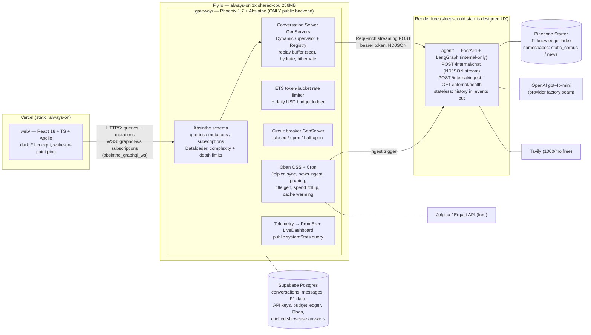

# ChatFormula1 v2 — "Pit Wall" Architecture & Roadmap

**The blueprint for ChatFormula1 v2: an Elixir/Phoenix GraphQL gateway, a slimmed Python LangGraph inference engine, and a React/Apollo frontend — built to run on free tiers without feeling free.**

> ChatFormula1 is an unofficial fan project. It is not affiliated with, endorsed by, or connected to Formula 1, the FIA, or any F1 team. This disclaimer appears in the README, repo description, and site footer.

---

## 1. Executive Summary

ChatFormula1 v2 is a public portfolio demo proving one author can design and ship a production-shaped system across **Elixir/OTP, GraphQL, and AI** — with each layer carrying real, inspectable engineering weight. The AI is deliberately *not* the only star.

**The shape:** three apps, two backend services, one database, one vector index.

- **`gateway/` (Elixir 1.18 / OTP 28, Phoenix 1.7+, Absinthe, Ecto/Postgres, Oban OSS)** — the *only* public backend and the application's center of gravity. It owns the entire GraphQL surface (queries, mutations, subscriptions), all conversation state, identity, rate limiting, API keys, budget enforcement, background jobs, and telemetry. Its OTP centerpiece is a **per-conversation GenServer** (DynamicSupervisor + Registry) with Postgres hydration, an in-process seq-numbered replay buffer for reconnecting subscribers, idle hibernation, and supervised streaming workers.
- **`agent/` (Python 3.12, FastAPI, LangGraph)** — slimmed to a **stateless, internal-only inference engine**. It keeps the genuinely load-bearing ~40% of the current codebase (the LangGraph pipeline, Pinecone retrieval, Tavily search, inference caches, prompt-injection guards) and deletes the dead ~60% (unwired nodes.py, memory.py, the never-bound tool layer, ~900 lines of unused prompts, Streamlit and its 1,540 lines of UI tests). One NDJSON streaming endpoint in, typed events out.
- **`web/` (React 18, TypeScript, Vite, Apollo Client, Tailwind, shadcn/ui)** — a static dark, F1-inspired cockpit on Vercel. Streaming chat with a live "pit wall" telemetry strip rendering LangGraph node transitions, standings/calendar pages from pure GraphQL queries, and a public ops panel rendering real BEAM stats.

**The headline demo:** a `sendMessage` mutation streams LLM tokens from LangGraph through a supervised BEAM process tree into an Absinthe GraphQL subscription, rendered token-by-token in Apollo — while the UI shows which pipeline node is executing. Kill the Python service mid-stream on camera: the supervisor publishes a normalized error, the circuit breaker opens, the UI degrades gracefully, and every other conversation keeps streaming.

**Survivability:** wake-on-paint choreography hides free-tier cold starts behind the landing page; a **SHOWCASE mode** token-replays pre-generated answers through the *identical* publish path (with an honest "replayed from cache" badge) when the daily LLM budget is spent or the agent is down — so a recruiter at 3 a.m. always sees a streaming demo. A nightly Oban job syncs 2026 standings from the free Jolpica/Ergast API so the non-AI GraphQL data stays alive without LLM spend.

**Cost: $0/month fixed.** The only variable exposure is OpenAI tokens (default **gpt-4o-mini** behind a provider seam), capped by a hand-rolled ETS rate limiter, a hard daily USD ledger, and an account-level billing cap.

---

## 2. System Architecture

### Service boundary principle

**The Elixir gateway IS the application. Python is a stateless inference engine. React is a rendering surface.** Everything with state, identity, policy, or scheduling lives on the BEAM; everything that must survive a restart lives in Postgres.

| Concern | Owner | Notes |
|---|---|---|
| GraphQL queries / mutations / subscriptions | Gateway | GraphiQL public (read-rate-limited) as a demo artifact |
| Conversation + message persistence | Gateway (Ecto/Postgres) | Replaces `chat.py`'s in-memory `session_storage` MemorySaver dict; fixes restart-loss + IDOR in one move |
| Hot conversation state, replay buffers | Gateway (per-conversation GenServer) | Hydrates from Postgres; idle timeout + `:hibernate` |
| Identity (anonymous viewer tokens, API keys) | Gateway | Signed `Phoenix.Token` cookies; `f1s_`-prefixed keys, SHA-256 at rest, scopes — **enforced** via plug + Absinthe middleware, fixing the never-registered `AuthenticationMiddleware` theater |
| Rate limiting + daily LLM budget ledger | Gateway | Hand-rolled ETS dual-window token bucket; Postgres budget row flips SHOWCASE mode |
| Transport-level input validation | Gateway | Length 1–2000, repeated-char DoS, control-char/HTML strip — Absinthe input objects + changesets |
| Structured F1 data (drivers/constructors/races/results/standings) | Gateway (Postgres) | Seeded from `data/*.json`, refreshed nightly via Jolpica/Ergast Oban job — the zero-LLM-cost GraphQL depth showcase |
| Background jobs, telemetry, observability | Gateway | Oban OSS + Cron, `:telemetry` + PromEx + LiveDashboard |
| LangGraph pipeline (analyze → route → retrieve → rank → generate) | Agent | `import asyncio` bug fixed; graph compiled **once** at startup; no checkpointer |
| Pinecone retrieval, Tavily search, inference TTL caches | Agent | Deterministic vector IDs + namespaces; migrated to `langchain-tavily` |
| Prompt-injection heuristics | Agent | They belong next to the LLM |
| Offline ingestion CLI | Agent | Persisted dedup state, SHA-256 hashing, `make reindex` rebuilds Pinecone from scratch |
| Rendering, optimistic UI, wake-on-paint ping | Web | Zero business logic, zero secrets |

### Topology diagram



**Wake-on-paint choreography:** the frontend's first paint fires `GET /up` at the gateway; the gateway's warmup process immediately pings `agent/internal/health`, so Render's 30–60 s cold start burns while the visitor is still reading the hero copy. If a visitor types instantly, the stream opens with `WARMING_UP` pipeline events rendered as pit-radio chatter — a designed state with its own UI pass, never a dead spinner.

---

## 3. Absinthe GraphQL Schema (SDL)

Served with **query complexity analysis and max-depth limits** (cheap insurance on a public GraphiQL endpoint), Dataloader-batched associations, and a custom middleware stack (viewer auth → API-key scopes → rate limit → input validation → error normalization).

```graphql
scalar DateTime

# ─────────── F1 structured data (Postgres + Dataloader; zero LLM cost) ───────────
type Driver {
  id: ID!
  code: String!
  number: Int!
  fullName: String!
  nationality: String!
  constructor: Constructor!          # Dataloader — provable no-N+1
  results(season: Int): [RaceResult!]!
}
type Constructor { id: ID!, name: String!, points: Float!, drivers: [Driver!]! }
type Race {
  id: ID!
  season: Int!
  round: Int!
  name: String!
  circuit: String!
  country: String!
  startsAt: DateTime!
  results: [RaceResult!]!
}
type RaceResult {
  driver: Driver!
  race: Race!
  gridPosition: Int
  finishPosition: Int
  points: Float!
  podium: Boolean!
}
type StandingRow { position: Int!, driver: Driver!, points: Float!, wins: Int!, podiums: Int! }

# ─────────── Conversations ───────────
enum MessageRole { USER ASSISTANT }
enum MessageStatus { PENDING STREAMING COMPLETE FAILED }
type Conversation {
  id: ID!
  title: String
  insertedAt: DateTime!
  messages(first: Int, before: String): [Message!]!
}
type Message {
  id: ID!
  role: MessageRole!
  content: String!
  status: MessageStatus!
  intent: String
  sources: [Source!]!
  cached: Boolean!
  latencyMs: Int
  insertedAt: DateTime!
}
type Source { kind: SourceKind!, title: String!, url: String, snippet: String, score: Float }
enum SourceKind { VECTOR WEB }

# ─────────── Agent stream events (subscription payload — union showcase) ───────────
union AgentEvent =
    TokenDelta
  | NodeTransition
  | SourcesResolved
  | MessageCompleted
  | AgentError

type TokenDelta { messageId: ID!, seq: Int!, text: String! }
type NodeTransition { messageId: ID!, node: AgentNode!, startedAt: DateTime! }
enum AgentNode {
  WARMING_UP          # agent cold-starting (Render wake)
  ANALYZE_QUERY
  ROUTE
  VECTOR_SEARCH
  WEB_SEARCH
  PARALLEL_RETRIEVAL
  RANK_CONTEXT
  GENERATE
  FORMAT_RESPONSE
  REPLAYING_CACHE     # SHOWCASE-mode token replay
}
type SourcesResolved { messageId: ID!, sources: [Source!]! }
type MessageCompleted { messageId: ID!, message: Message!, cached: Boolean!, usage: TokenUsage }
type TokenUsage { promptTokens: Int!, completionTokens: Int!, estimatedCostUsd: Float! }
type AgentError { messageId: ID!, code: ErrorCode!, message: String!, retryable: Boolean! }
enum ErrorCode { UPSTREAM_UNAVAILABLE RATE_LIMITED BUDGET_EXHAUSTED VALIDATION INTERNAL }

# ─────────── Ops (the Elixir showcase, queryable) ───────────
enum ServiceMode { LIVE DEGRADED SHOWCASE }   # SHOWCASE = budget spent / agent down → cached replay
type RateLimitStatus {
  limitPerMinute: Int!
  remainingMinute: Int!
  limitPerHour: Int!
  remainingHour: Int!
  resetsAt: DateTime!
}
type SystemHealth {
  mode: ServiceMode!
  gateway: ServiceStatus!
  agentService: ServiceStatus!
  database: ServiceStatus!
  breakerState: BreakerState!
}
enum ServiceStatus { HEALTHY DEGRADED DOWN }
enum BreakerState { CLOSED OPEN HALF_OPEN }
type SystemStats {
  activeConversations: Int!
  beamProcessCount: Int!
  uptimeSeconds: Int!
  p95FirstTokenMs: Int
  tokensPerSecond: Float
  obanJobsCompleted24h: Int!
  lastStandingsSyncAt: DateTime
  llmSpendTodayUsd: Float!
  dailyBudgetRemainingUsd: Float!
}

type Query {
  drivers(season: Int): [Driver!]!
  driver(code: String!): Driver
  races(season: Int!): [Race!]!
  nextRace: Race                       # homepage countdown
  standings(season: Int!): [StandingRow!]!
  conversation(id: ID!): Conversation  # scoped to viewer token — fixes the inherited IDOR
  conversations: [Conversation!]!      # viewer's own only; no global enumeration
  demoQuestions: [String!]!            # chips wired to pre-warmed SHOWCASE answers
  rateLimitStatus: RateLimitStatus!
  systemHealth: SystemHealth!
  systemStats: SystemStats!            # only telemetry-fed numbers — no theater
}

type Mutation {
  startConversation: Conversation!
  "Validates + persists user msg and assistant placeholder, kicks off the stream, returns immediately."
  sendMessage(conversationId: ID!, content: String!): SendMessagePayload!
  deleteConversation(id: ID!): Boolean!
  submitFeedback(messageId: ID!, helpful: Boolean!): Boolean!
  "Requires API key scope 'admin:ingest'; enqueues an Oban job. Allowlisted sources only."
  triggerIngest(source: IngestSource!): IngestJob!
}
type SendMessagePayload { userMessage: Message!, assistantMessageId: ID! }
enum IngestSource { NEWS HISTORICAL CALENDAR }
type IngestJob { id: ID!, state: String!, queuedAt: DateTime! }

type Subscription {
  "Topic agent:<message_id>; subscription-time authorization against the viewer token."
  agentStream(messageId: ID!): AgentEvent!
  conversationUpdated(conversationId: ID!): Message!
  systemHealthChanged: SystemHealth!   # lets the UI flip LIVE/SHOWCASE badges in real time
}
```

---

## 4. Token Streaming Design — End to End

**The frozen interface between services is the NDJSON event protocol, documented in `docs/STREAMING_PROTOCOL.md` and enforced by CI contract tests on both sides** (a recorded NDJSON stream replayed against the Elixir parser via Bypass; a Python test asserting exact event sequence).

### 4.1 Python emits NDJSON

`POST /internal/chat` runs the once-compiled graph (no checkpointer, compiled at startup — the per-request recompilation pattern dies) via `astream_events` **v2**. The generation `ChatOpenAI` is constructed with `tags=["generation"]`; the handler forwards `on_chat_model_stream` **only** for that tag — this kills the current bug where `analyze_query`'s structured-output JSON leaks into the user-visible stream. One event per line on a chunked response:

```
{"event":"node_started","node":"vector_search"}
{"event":"sources","items":[{"kind":"vector","title":"...","score":0.83}]}
{"event":"token","text":"Verst"}
{"event":"complete","content":"<full text>","cached":false,"usage":{"prompt_tokens":...,"completion_tokens":...}}
{"event":"error","code":"...","retryable":true}
```

LLM-cache hits legally emit **zero** `token` events and a single `complete` with `cached: true` — explicit in the contract, not a client surprise. Request body: `{message, history: [last-10 window], request_id}` — the agent is fully stateless; the gateway owns the thread.

### 4.2 Mutation kicks off

`sendMessage` resolver: Absinthe middleware chain (viewer auth → ETS rate limit → input validation) → `Ecto.Multi` inserts the user `Message` and an assistant `Message` placeholder (status `PENDING`) → ensures the `Conversation.Server` is running (Registry lookup-or-start under `DynamicSupervisor`) → `begin_stream(conv_id, assistant_msg_id)` → returns `{userMessage, assistantMessageId}` in <50 ms. No LLM work in the resolver.

### 4.3 Mode gate, then StreamRunner

`Conversation.Server` first checks the **budget ledger** and **circuit breaker**:

- **Breaker open / budget exhausted → SHOWCASE path:** skip Python entirely. An Oban warming job has pre-generated answers for every `demoQuestions` entry (plus top real queries), stored with their **original token-timing histograms**. The server replays them through the *identical* publish path with timer-driven pacing — real `NodeTransition{REPLAYING_CACHE}`, `TokenDelta`, `MessageCompleted{cached: true}` events. The UI shows an honest "replayed from cache" badge. The demo streams convincingly at zero LLM spend.
- **LIVE path:** start a monitored task under `ChatF1.StreamTaskSupervisor` (`Task.Supervisor`) that opens `Req.post!(agent_url, json: payload, into: reducer)` over Finch streaming. Chunks are line-buffered; each complete NDJSON line is decoded and cast to the `Conversation.Server`. If the agent is cold-starting, the runner emits `NodeTransition{WARMING_UP}` and retries with backoff up to 45 s. `:telemetry.span` wraps the call; the first token emits `[:chatf1, :agent, :first_token]` with TTFT.

### 4.4 Conversation.Server fans out

For each event the GenServer:

1. Appends to its **replay buffer** with a monotonically increasing `seq` (hard cap: **32 KB per message**, oldest-token truncation);
2. **Micro-batches tokens** — flush every 40 ms or 12 tokens via `Process.send_after` — so `Absinthe.Subscription.publish` is not called per token (PubSub + websocket frame overhead is real on a 256 MB machine);
3. Publishes to topic `agent:<message_id>`: `node_started → NodeTransition` (drives the telemetry strip), `sources → SourcesResolved`, `complete → Ecto.Multi [update message content/status/usage, decrement budget ledger, insert telemetry rollup]` then `MessageCompleted`, `error → mark FAILED + AgentError`.

### 4.5 Reliability semantics

- **Reconnects:** `seq` numbers make gaps client-detectable. On re-subscribe, the resolver replays buffered events from the GenServer before going live. The frontend reducer is **idempotent by seq** (the replay/live overlap race has an explicit integration test). *Scope valve:* if Phase 3 slips, replay-buffer cuts to refetch-on-reconnect (the final message is always in Postgres — a dropped socket just refetches `conversation(id)`).
- **Crashes:** if the StreamRunner or Python dies mid-stream, the `:DOWN` message marks the message `FAILED`, publishes a retryable `AgentError`, and increments the breaker. One crashed stream never touches other conversations — supervision is user-visible.
- **Cache hits:** the gateway synthesizes one `TokenDelta` carrying the full text before `MessageCompleted`, so the frontend render path is uniform.
- **Lifecycle:** idle `Conversation.Server`s self-terminate after 15 min (`handle_info(:timeout)`); state survives in Postgres.

### 4.6 Absinthe → Apollo

Subscriptions ride Phoenix Channels over `Phoenix.PubSub` (PG2, single node — no Redis). The gateway exposes **standard `graphql-ws` via `absinthe_graphql_ws`** so Apollo uses its mainstream `GraphQLWsLink` (deliberately avoiding the stale `@absinthe/socket` packages). Apollo split link: HTTP for queries/mutations, WSS for subscriptions. The chat component subscribes per `assistantMessageId`, reduces `TokenDelta` batches into the streaming bubble (in-memory buffer; only `MessageCompleted` writes the normalized cache), and renders `NodeTransition` events as the live pipeline indicator. Subscription-time topic authorization checks the viewer token owns the message's conversation — no cross-tenant streaming.

---

## 5. Elixir/OTP Showcase Inventory

Every item below is reachable from the live demo or readable in ≤2 files — no theater.

1. **Documented supervision tree** (diagram + `:observer` screenshot in docs): `ChatF1.Application` supervising `Repo`, `Phoenix.PubSub`, `ConvRegistry` (Registry), `ConversationSupervisor` (DynamicSupervisor), `StreamTaskSupervisor` (Task.Supervisor), `Agents.Breaker`, Finch pool, Oban, PromEx, `Endpoint` — with a scripted kill-a-GenServer-mid-demo showing crash isolation.
2. **Per-conversation GenServer** (`ChatF1.Conversations.Server`): Registry via-tuples, lazy start, Postgres hydration, idle `:timeout` + `:hibernate`, and a capped seq-numbered **replay buffer** re-feeding reconnecting subscribers — the OTP money shot.
3. **Absinthe depth:** Dataloader (Ecto source) batching driver→constructor→results (provable no-N+1 on standings), **query complexity + max-depth analysis**, union-typed subscription payloads (`AgentEvent`), custom middleware stack with normalized `ErrorCode` errors.
4. **Absinthe.Subscription over Phoenix.PubSub** with per-message topics, subscription-time authorization, and micro-batched publishes (40 ms / 12 tokens) — a real backpressure decision.
5. **Hand-rolled ETS dual-window token-bucket rate limiter** (per-minute burst + per-hour) as a GenServer-owned ETS table + Plug + Absinthe middleware, emitting telemetry on allow/deny, queryable via `rateLimitStatus` — deliberately not Hammer; "I built it" is the interview line.
6. **Circuit breaker GenServer** (closed/open/half-open with timed probe) guarding the Python upstream, surfaced in `systemHealth`, wired to Render cold-start reality — failure handling as a feature.
7. **Oban OSS + Cron:** nightly **Jolpica/Ergast standings sync** (unique jobs, exponential backoff — self-maintaining 2026 data), nightly Tavily news-ingest trigger, daily conversation TTL pruning, conversation title generation, SHOWCASE cache warming, daily LLM-spend rollup flipping `ServiceMode`.
8. **Telemetry as a first-class surface:** `:telemetry.span` around the agent stream (TTFT, tokens/sec, per-node durations), Phoenix/Ecto/Absinthe/Oban metrics via PromEx, LiveDashboard behind API-key auth, and a curated public `systemStats` query rendered as the frontend pit-wall panel — only telemetry-fed numbers.
9. **Task.Supervisor-monitored streaming HTTP client** (Req/Finch `into:` reducer with NDJSON line-buffering) and `:DOWN`-based cleanup — process monitoring doing real work.
10. **Phoenix.Token anonymous viewer identity** + Postgres-backed API keys (`f1s_` prefix, SHA-256 at rest, scope wildcards, rotate/revoke, raw key shown once) — *enforced for the first time in this project's history*.
11. **Ecto.Multi transactional message lifecycle** + changeset validation mirrored into Absinthe input objects.
12. **Daily USD budget ledger** in Postgres (decremented from agent-reported usage) driving SHOWCASE mode — the real FreeTierLimiter the old README only pretended existed.
13. **Mix release** with `runtime.exs`, `Oban.Notifiers.PG` (single-node, pooler-safe), `/healthz` and `/up` plugs.
14. **ExUnit story:** Absinthe.run schema tests, `Phoenix.ChannelTest` subscription tests (including kill-the-runner-mid-stream and the reconnect/replay race), `Oban.Testing` for jobs, **Bypass** contract tests replaying recorded NDJSON against the parser.

---

## 6. Monorepo Layout

```
chatformula1/
├── README.md                  # 30-sec sell: hero GIF of token streaming, mermaid diagram,
│                              # "three files to read" (conversations/server.ex, schema.ex, graph.py),
│                              # quickstart, CI badges, disclaimer, free-tier honesty notes
├── LICENSE
├── Makefile                   # make setup / dev / test / lint / demo / reindex — fans out to all apps
├── docker-compose.yml         # postgres:16 + agent for local dev (gateway runs native via mix)
├── data/                      # races.json, drivers.json, historical_features.csv
│                              # (gateway seeds + agent ingestion input; showcase
│                              #  answers live in Postgres, warmed by an Oban job)
├── docs/
│   ├── ARCHITECTURE.md        # this document: service boundary, schema, token path narrative
│   ├── STREAMING_PROTOCOL.md  # the frozen NDJSON event contract + AgentEvent mapping
│   ├── GRAPHQL.md             # schema tour + example operations
│   ├── DEPLOYMENT.md          # Fly/Render/Supabase/Pinecone/Vercel free-tier runbook
│   ├── DEMO.md                # the 5-minute demo script
│   └── adr/
│       ├── 000-single-node-invariants.md   # ETS limiter, local PubSub, replay buffers,
│       │                                   # Oban.Notifiers.PG all assume ONE machine; count pinned in fly.toml
│       ├── 001-two-services.md
│       ├── 002-model-agnostic-providers.md
│       ├── 003-ndjson-over-sse.md
│       ├── 004-supabase-over-neon.md       # Oban polling burns Neon's ~190 free compute-hrs in ~8 days
│       ├── 005-showcase-mode.md
│       └── 006-handrolled-rate-limiter.md
├── .github/workflows/
│   ├── gateway.yml            # path-filtered: mix format --check, credo, dialyzer (cached PLT), mix test
│   ├── agent.yml              # path-filtered: ruff, mypy, pytest — DUMMY KEYS ONLY
│   ├── web.yml                # path-filtered: tsc, eslint, vitest, codegen drift check
│   └── wake-cron.yml          # daily wake-ping; doubles as uptime check — opens a GitHub issue on failure
├── gateway/                   # Elixir 1.18 / OTP 28 / Phoenix 1.7 — THE application
│   ├── mix.exs
│   ├── fly.toml               # min/max machine count pinned to 1 (ADR-000)
│   ├── config/{config,dev,test,prod,runtime}.exs
│   ├── lib/chat_f1/
│   │   ├── application.ex     # the supervision tree, heavily commented
│   │   ├── conversations/     # context + server.ex (GenServer) + stream_runner.ex
│   │   ├── formula1/          # drivers/constructors/races/results context + standings + jolpica_sync
│   │   ├── agents/            # client.ex (Req/Finch NDJSON), breaker.ex, events.ex
│   │   ├── rate_limit/        # ETS token bucket GenServer + plug + absinthe middleware
│   │   ├── budget/            # daily USD ledger + ServiceMode
│   │   ├── showcase/          # cached answers + timing-histogram replayer
│   │   ├── accounts/          # viewer tokens, api_keys
│   │   ├── workers/           # Oban: jolpica_sync, ingest_news, prune_conversations,
│   │   │                      #       title_gen, spend_rollup, warm_showcase_cache
│   │   └── telemetry/         # promex.ex, span helpers
│   ├── lib/chat_f1_web/
│   │   ├── endpoint.ex / router.ex / channels/
│   │   └── schema/            # schema.ex, types/, resolvers/, middleware/, dataloader source
│   ├── priv/repo/{migrations,seeds.exs}    # seeds from ../data
│   └── test/                  # contexts, resolvers, subscription integration (kill-mid-stream,
│                              # reconnect race), rate limiter, breaker, Oban.Testing, Bypass contract
├── agent/                     # slimmed Python 3.12 LangGraph service — internal-only
│   ├── pyproject.toml         # exact-pinned langgraph/langchain; no streamlit, no isort-in-runtime
│   ├── Dockerfile             # reuses existing builder/production stages
│   ├── src/chatf1_agent/
│   │   ├── graph.py           # fixed F1AgentGraph (+ import asyncio, tags=["generation"],
│   │   │                      #  ContextScore ranking salvaged, dynamic year)
│   │   ├── state.py           # AgentState + QueryAnalysis ONLY
│   │   ├── prompts.py         # F1_EXPERT_SYSTEM_PROMPT
│   │   ├── providers.py       # LLM factory seam — gpt-4o-mini default
│   │   ├── retrieval/         # vector_store.py (namespaces, deterministic IDs), tavily.py (langchain-tavily)
│   │   ├── guards.py          # prompt-injection heuristics
│   │   ├── caching.py         # inference-path TTL caches (single-replica by design)
│   │   └── server.py          # FastAPI: /internal/chat (NDJSON), /internal/ingest, /internal/health
│   ├── ingestion/             # offline CLI pipeline (persisted dedup state, SHA-256, deterministic IDs)
│   └── tests/                 # salvaged: security, prompts, processor, loader, graph integration
│                              # + NDJSON contract test (exact event sequence)
└── web/                       # React 18 + TS + Vite + Apollo + Tailwind + shadcn/ui
    ├── src/
    │   ├── graphql/           # .graphql documents + codegen output (typed hooks)
    │   ├── components/{chat,telemetry,standings,layout}/
    │   ├── lib/apollo.ts      # split link: HttpLink + GraphQLWsLink (graphql-ws → absinthe_graphql_ws)
    │   ├── routes/            # Chat (default), Standings, Calendar, Driver, About/Architecture
    │   └── theme/             # dark carbon-fiber F1 theme
    ├── codegen.ts
    └── vite.config.ts
```

---

## 7. Free-Tier Hosting Topology

Two backend services (constraint-compliant), $0/month fixed.

| Component | Provider | Configuration & rationale |
|---|---|---|
| **Gateway** | **Fly.io** — 1× shared-cpu-1x **256 MB**, `auto_stop_machines = false`, machine count pinned to 1 | The gateway terminates WebSockets and hosts GenServer state — it **cannot sleep**. Fly is the only free option tolerating 24/7 + long-lived websockets. BEAM tuning: `ERL_FLAGS=+hmqd off_heap`, capped Finch pool, micro-batched publishes, 32 KB replay-buffer caps. Mix release in slim Alpine; `/healthz` for Fly checks; `/up` for wake-on-paint. Single node → PG2 PubSub, no Redis. |
| **Agent** | **Render** free web service — **allowed to sleep** after 15 min idle | Always-on would burn ~720 of 750 free instance-hours. Cold start is a designed state: breaker reports `DOWN→HALF_OPEN`, UI shows the "warming up the engines" lights-out animation, wake-on-paint pre-warms, and Oban pings `/internal/health` 90 s before the nightly ingest. Internal auth: long random bearer token in both services' secrets. |
| **Postgres** | **Supabase** free (500 MB), **not Neon** | The always-on gateway holds persistent connections and Oban polls every second — that burns Neon's ~190 free compute-hours/month in ~8 days (ADR-004). Supabase has no compute-hour meter. Supavisor session mode (or direct IPv6 from Fly); Ecto `pool_size: 5`; `Oban.Notifiers.PG` so nothing depends on LISTEN/NOTIFY through a pooler. The daily Oban cron heartbeat defeats Supabase's 7-day-inactivity pause. Neon fallback documented (aggressive idle disconnect + raised Oban poll interval) but not default. |
| **Vector store** | **Pinecone** Starter serverless — existing `f1-knowledge` index (aws/us-east-1, the only free region; 1536-dim, text-embedding-3-small) | Namespaces (`static_corpus` / `news`) + deterministic content-hash IDs added at migration so re-ingestion upserts instead of duplicating. `make reindex` rebuilds the entire index from `data/` in one command — the index is cattle, not a pet (Starter indexes have inactivity-deletion precedent). |
| **Frontend** | **Vercel** free (Hobby) | Static Vite build; env-injected GraphQL HTTPS + WSS URLs at the Fly hostname; `chatformula1.com` via CNAME; **PR preview deploys** as a free recruiter-visible bonus. The landing page renders in <1 s regardless of backend state. |
| **LLM** | **OpenAI gpt-4o-mini** (generation *and* analysis) behind `providers.py` | gpt-4-turbo was a cost bug for a free demo. Defense in depth: ETS rate limiter → daily USD ledger → SHOWCASE mode → **account-level hard spend cap on the OpenAI billing console**. |
| **Web search** | **Tavily** free (1000/mo) | Nightly Oban ingest uses ~30/mo; runtime searches bounded by the agent's existing 60/min window. |
| **Live F1 data** | **Jolpica/Ergast** API (free) | Nightly Oban standings/results sync keeps 2026 data current at zero LLM cost; seeds remain hand-refreshable if the community API lapses. |
| **Scheduling/uptime** | **GitHub Actions** cron (free on public repos) | Daily wake-ping doubles as an uptime check that opens a GitHub issue on failure — a public health trail. |
| **Observability** | PromEx `/metrics` + LiveDashboard (API-key gated) + public `systemStats` query | Optional Grafana Cloud free scrape; the frontend pit-wall panel is the primary surface. |
